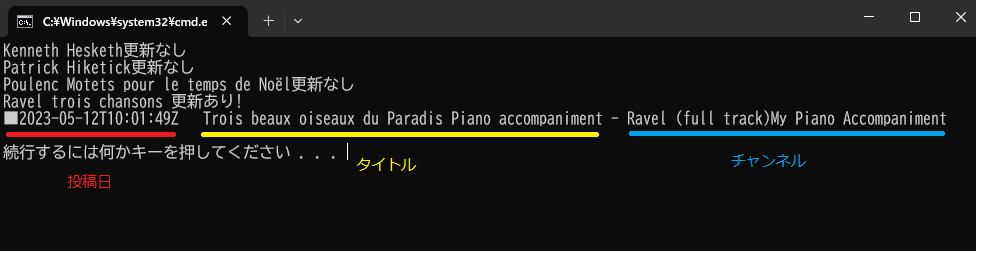
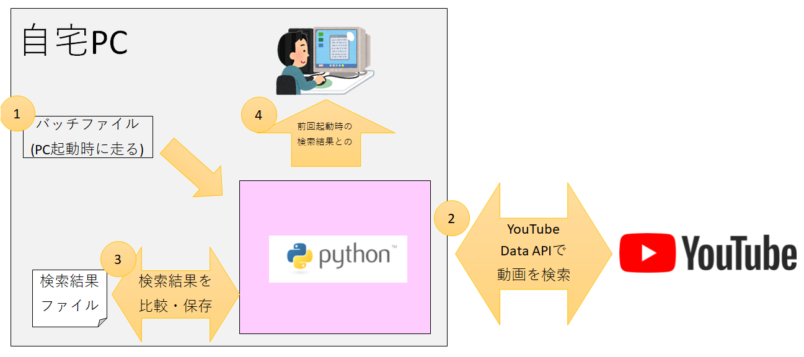

# YouTube新着動画チェックスクリプト
## 画面イメージ

## できること
ゲームタイトル、曲名、作曲者名などの<strong>「検索結果」</strong>上に新しい動画が出たことを通知してくれる
+ 公式アプリの新着動画通知機能は「チャンネル(投稿者)」に紐づいているため、検索結果上に新しい動画が現れるようになっても通知してくれるわけではない
+ 公式アプリの検索結果はデフォルトの状態では投稿日付順ではなく謎のアルゴリズムにより整列されているため、新着動画を確認するには毎回手動で並び替え設定を実施しなければならない

## 重視したこと
+ とにかく簡単に、新着動画をチェックできること 
  そのため、スクリプト実行タイミングはWindowsPCの起動に紐づけた
+ YouTube Data APIの使用感を試すこと

## 重視しなかったこと
+ GUIはつくらず、ターミナル上に検索結果を表示するものとした 
  (ポチポチ画面をいじるなら公式アプリとあまりかわらないため)
+ 表示する情報は「投稿日」「タイトル」「チャンネル」のみとした 
  (新着動画があることが分かり次第公式アプリを開くため、これ以上の情報は不要とした)
+ YouTube Data APIのクォータ制限についてはあまり意識しなかった 
  (1日にそう何回もPCを付けたり消したりはしないため)

## ポンチ絵

